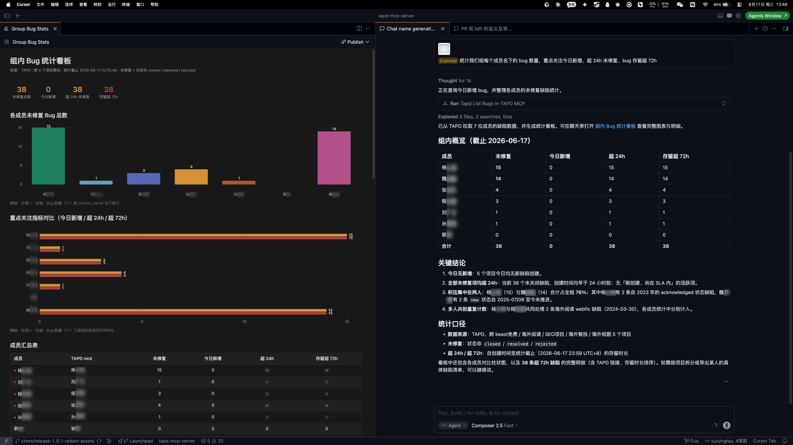
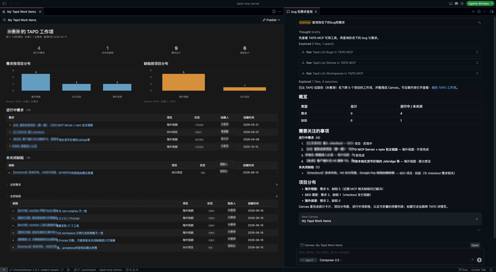
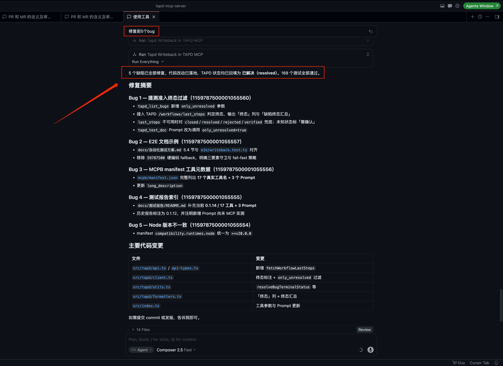

<p align="center">
  
</p>

<h1 align="center">TAPD MCP Server</h1>

<p align="center">
  <strong>把 TAPD 装进你的 IDE 对话框 —— 查需求、评 PRD、修 Bug、回填提测，一句话直达，全程不切窗口。</strong>
</p>

<p align="center">
  <a href="https://www.npmjs.com/package/tapd-mcp-server"></a>
  <a href="./CHANGELOG.md"></a>
  
  
  <a href="./package.json"></a>
</p>

## ✨ 核心亮点

- 🔌 **一键安装** —— 一段 `npx` 配置即用，无需 clone 仓库或装依赖，团队复制即接入。
- 🐞 **Bug / 需求一条龙** —— 查询、读详情、分析定位、回填状态 / 评论 / 处理人，缺陷与需求全流程都在对话里完成（写操作均需你确认）。
- 🗂️ **跨项目自动聚合** —— 一人负责多个项目？列表查询自动聚合你参与的全部项目，每条结果标注归属，无需逐个切换。
- 🤖 **内置工作流 Prompt** —— PRD 研发评估、提测报告、Bug 修复回填三套开箱即用，编排现有工具、读着你的代码给结论。
- 👥 **团队视角** —— 一句话让 Agent 跨成员、跨项目统计全组 bug / 需求（总数、未关闭、超 24h 未关闭、按成员拆分），组长盯进度直接可用（见下方「团队 Bug 统计」示例）。

## 🚀 快速开始

在 MCP 配置文件中添加以下内容，例如 `.cursor/mcp.json` 或 `.vscode/mcp.json`：

```json
{
  "mcpServers": {
    "TAPD MCP": {
      "command": "npx",
      "args": ["-y", "tapd-mcp-server"],
      "env": {
        "TAPD_ACCESS_TOKEN": "你的访问令牌"
      }
    }
  }
}
```

| 变量 | 说明 |
| --- | --- |
| `TAPD_ACCESS_TOKEN` | 必填。TAPD 个人访问令牌，获取路径：TAPD 个人设置 → 个人访问令牌。请只放在本机 MCP 配置里，不要提交到代码仓库 |
| `TAPD_ALLOW_RAW_WRITE` | 可选，默认关闭。设为 `true` 后才允许 `tapd_call_api` 发起 POST 写操作（每次调用仍需你在对话中确认），详见下文「通用透传」 |

## 💡 使用示例

### 1. 团队 Bug 统计

> 统计我们组每个成员名下的 bug 数量，重点关注今日新增、超 24h 未修复、bug 存留超 72h，图表展示

Agent 会先用 `tapd_search_users` 确认各成员 nick，再用 `tapd_list_bugs`（跨项目聚合）逐个统计，汇总出全组视图：每人的未关闭、今日新增、超 24h / 72h、挂起等数量，并可按成员拆分明细。配合客户端的可视化能力（如 Cursor Canvas），还能直接生成下面这样的看板，组长盯进度一目了然。



> 这是一个由 Agent 编排多个 MCP 工具完成的使用场景，并非单个内置工具；统计维度与可视化形式由你的指令和客户端能力决定。

### 2. 查询我名下的需求和 Bug

> 列出我名下待处理的需求和 bug

Agent 跨项目聚合查询你负责的需求与缺陷，返回带内嵌超链接的 Markdown 表格——名称即链接、点击直达 TAPD，并标注每条所属项目。可继续按状态、创建时间、关联需求等过滤，或指定某个项目 ID 只查该项目。



### 3. 批量判断服务端归因并追加处理人

> 分析我名下待处理的 bug，哪些更像是服务端原因，并在处理人里添加服务端同学亚勇

Agent 会先查询 bug 详情，再根据现象、接口返回、复现步骤等信息判断疑似服务端问题。更新处理人前会先用 `tapd_search_users` 确认成员身份，最后经你确认后再写回 TAPD。

### 4. Bug 批量修复并回填

> 帮我修复 123456、123457，结合代码定位并给出修改方案

Agent 跨项目定位各 bug、拉取完整上下文（描述、复现、评论、附件、图片），结合当前代码库给出问题定位与修改建议（改码需你确认）；修复后用内置 Prompt `tapd_bug_fix_writeback` 生成回填草稿，确认后把状态改为已解决并写入评论，不会主动更新处理人。



### 5. 需求宣讲前研发评估

> 使用 tapd_prd_analysis 分析需求 123456，生成需求宣讲前研发评估报告

支持 MCP Prompts 的客户端会自动获得 `tapd_prd_analysis`。Agent 获取需求详情，按需查询需求变更、关联测试用例和关联 bug，再阅读当前代码库定位相关路由、页面、组件、接口、状态管理、数据模型、权限、埋点和配置，结合代码现状给出研发视角的判断（结论先行、不复述 PRD，写操作均需你确认）。

报告按固定模板输出，便于宣讲前快速过审：

- **结论** —— 需求目标、改动范围、最大风险、必须确认；
- **技术判断** —— 相关代码、实现方案、接口 / 数据 / 权限；
- **风险与依赖** —— 主要风险、外部依赖、漏洞 / 异常场景；
- **测试建议** —— 验收路径、边界 / 回归；
- **待确认问题** —— 最多 3 条，不确定项标注「需要确认」，不臆测、不凑数。

### 6. 提测准入判断并生成提测文档

> 使用 tapd_test_doc 生成提测文档，测试环境是 https://example.com/checkout.html

支持 MCP Prompts 的客户端会自动获得 `tapd_test_doc`，只读代码、不改 TAPD，分两阶段：

1. **提测准入判断** —— 自动对照需求的 PRD 用例、验收要点和未关闭缺陷，判断本次改动是否达标。
2. **生成提测文档** —— 达标或你确认后，把代码改动翻译成「本次提测」与「测试重点」，写入项目根目录 `提测文档.md`。

两种典型结果：

- **准入通过** —— 直接生成提测文档，含 `测试环境` / `本次提测` / `测试重点` / `已知问题` 四段。
- **准入不达标** —— 逐条列出差距，请你三选一：**A 继续提测并记为已知问题** / **B 继续提测忽略风险** / **C 终止提测**；未决策前不生成文档。

## 🧰 能力总览

### 工具（18）

> 🛡️ 创建、回填、上传等写操作工具均内置二次确认：执行前需要你在对话中明确同意，防止 AI 未经授权修改 TAPD 数据；`tapd_call_api` 的 POST 写操作另需环境变量 `TAPD_ALLOW_RAW_WRITE=true` 开启。详见下文「安全确认」。

**需求（Story）**

| 工具 | 作用 |
| --- | --- |
| `tapd_list_stories` | 查询需求列表，支持跨项目聚合与多字段过滤 |
| `tapd_get_stories` | 获取需求完整详情（描述、评论、附件、内嵌媒体） |
| `tapd_create_story` | 创建需求，支持处理人、优先级、迭代、父需求、标签、排期、工时、自定义字段等 |
| `tapd_writeback_story` | 回填需求评论 / 描述 / 状态 / 处理人，及标题、优先级、迭代、工时、标签等标准字段和自定义字段 |
| `tapd_list_story_changes` | 查询需求变更历史 |
| `tapd_list_story_test_cases` | 查询需求关联的测试用例 |

**缺陷（Bug）**

| 工具 | 作用 |
| --- | --- |
| `tapd_list_bugs` | 查询缺陷列表，支持跨项目聚合与多字段过滤 |
| `tapd_get_bugs` | 获取缺陷完整详情（描述、复现、评论、附件、内嵌媒体） |
| `tapd_create_bug` | 创建缺陷，支持处理人、优先级、严重程度、版本、迭代、排期、各类人员、工时、自定义字段等 |
| `tapd_writeback` | 回填缺陷评论 / 标题 / 描述 / 状态 / 处理人，及优先级、版本、迭代、工时、标签等标准字段和自定义字段 |
| `tapd_list_bug_changes` | 查询缺陷变更历史 |

**缺陷多媒体**

| 工具 | 作用 |
| --- | --- |
| `tapd_upload_bug_attachment` | 上传缺陷附件（png/mp4 等，≤250MB） |
| `tapd_upload_bug_image` | 上传描述内嵌图，返回 html_code（≤5MB） |
| `tapd_append_bug_description_image` | 上传图片并自动追加到缺陷描述（先读后写，避免覆盖） |

**项目 / 迭代 / 成员**

| 工具 | 作用 |
| --- | --- |
| `tapd_list_workspaces` | 查询你参与的项目（workspace） |
| `tapd_list_iterations` | 查询项目迭代，支持按名称、状态、起止时间、创建人、自定义字段等过滤并自定义排序 |
| `tapd_search_users` | 搜索 TAPD 成员，确认 nick，避免重名误写 |

**通用透传**

| 工具 | 作用 |
| --- | --- |
| `tapd_call_api` | 直接调用任意 TAPD OpenAPI 接口（任务、工时、测试计划、模块/版本配置、Wiki、看板等），兜底专用工具未覆盖的场景；path 以官方文档为准。POST 写操作默认禁用，需设置环境变量 `TAPD_ALLOW_RAW_WRITE=true` 且每次调用显式确认 |

### 工作流 Prompt（3）

随 MCP Server 一起分发，支持 MCP Prompts 的客户端会自动获得。**只编排现有工具、不新增写入能力**：

| Prompt | 作用 |
| --- | --- |
| `tapd_prd_analysis` | 需求宣讲前的简洁研发评估：读需求 + 关联用例 + 关联缺陷 + 你的代码库，输出研发视角判断 |
| `tapd_bug_fix_writeback` | Bug 修复后生成回填草稿，确认后改状态为已解决并写入评论 |
| `tapd_test_doc` | 先做提测准入判断（对照 PRD 关联用例评估是否达标），再生成提测文档 |

## 🛡️ 安全确认

- 查询类操作不会修改 TAPD 数据。
- 创建、回填评论、更新状态、更新处理人等写操作，都需要你在对话中明确确认。
- 更新处理人前，Agent 会先搜索并确认 TAPD 成员，避免根据中文名或重名信息误写。
- 处理人更新支持追加和替换。你说“添加、加上、补上”时会倾向追加；你说“改为、替换为、转给”时会倾向替换。

## 🎁 彩蛋玩法

### 定时巡检，模拟 AI 研发助理

> 每 2 小时检查需求 123456 下是否有新增未解决 bug；发现后读取 bug 详情和当前代码，判断原因、生成修复方案，并在我确认后修改代码和回填处理结果

配合支持定时任务的 Agent，可以把 TAPD MCP 变成一个轻量的 AI 研发助理：定时发现新缺陷、自动理解上下文、定位影响范围，并生成修复建议和回填草稿。

它也可以巡检工作空间里的新需求，自动完成研发评估，必要时进入创建分支和开发流程。巡检与分析自动执行，改代码、提交、回填 TAPD 等写操作仍由你确认。
